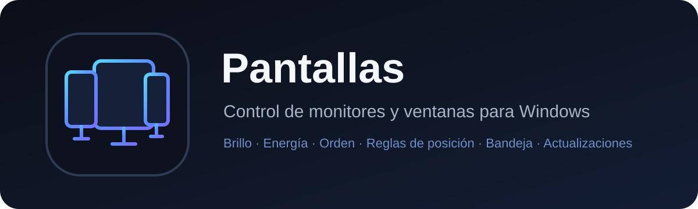

<p align="center">
  
</p>

<p align="center">
  <a href="https://github.com/Yakoderaa/Pantallas/actions/workflows/build-windows.yml"></a>
  <a href="https://github.com/Yakoderaa/Pantallas/actions/workflows/codeql.yml"></a>
  
  
</p>

# Pantallas

**Pantallas** is a native Windows desktop controller for multi-monitor setups.
It centralizes brightness, monitor power, monitor naming and ordering, system
tray shortcuts, and persistent window-position rules in one application.

The project is written in Python with PySide6 and uses Win32/DDC/CI APIs for
hardware and desktop integration.

> **Current release line:** V0.8 — adaptive per-monitor power control,
> professional Windows identity, hardened releases and reorganized
> documentation.

## Highlights

### Monitor control

- Detect active monitors and their resolution, orientation and Windows device.
- Assign friendly names such as **Left**, **Center**, **Right**, or **Vertical**.
- Reorder monitor cards independently from the Windows physical layout.
- Control brightness independently when the monitor exposes DDC/CI.
- Turn monitors off and restore them from the main window or system tray.
- Protect the last usable display by default.
- Optionally allow every monitor to be turned off after an explicit warning.

### Adaptive power engine

External monitors do not all implement power control the same way. Pantallas
therefore learns **per monitor** instead of assuming one method works
everywhere.

Each monitor supports:

- **Automatic** — learn and select the safest working method;
- **Windows** — disable the Windows display output;
- **DDC/CI** — use the monitor's MCCS power control directly.

DDC commands are verified. An API success response is not accepted as proof
that the panel actually turned off. If DDC turns a panel off but later fails to
wake it, Automatic mode records that failure and prefers Windows for that
monitor in future attempts.

See [Monitor power control](docs/POWER_CONTROL.md).

### Window position rules

Pantallas can bind applications such as Discord to a specific monitor and a
specific percentage-based area.

Examples:

- full screen;
- left or right half;
- top or bottom half;
- centered 70%;
- fully custom percentage geometry.

The system tray includes a global **Position lock** check mark. Clear it to
pause every positioning restriction; check it again to resume enforcement.

### Windows integration

- Optional startup with Windows.
- Optional minimized startup.
- Native system tray menu.
- Dedicated application identity for consistent taskbar grouping.
- Unified Pantallas icon for installer, EXE, taskbar, Start menu and shortcuts.
- Simplified icon optimized for the system tray.
- Automatic release checking and in-app update installation.

## Installation

Download the latest **PantallasSetup.exe** from
[GitHub Releases](https://github.com/Yakoderaa/Pantallas/releases).

The installer uses a per-user installation under:

```text
%LOCALAPPDATA%\Programs\Pantallas
```

No administrator permission is required for the normal installation.

Every official release also publishes:

```text
PantallasSetup.exe.sha256
```

Pantallas validates that checksum before launching an automatic update.

## Running from source

Requirements:

- Windows 10 or Windows 11;
- Python 3.11;
- a monitor connection that exposes the required feature for DDC/CI controls.

```powershell
git clone https://github.com/Yakoderaa/Pantallas.git
cd Pantallas
py -m venv .venv
.\.venv\Scripts\activate
pip install -r requirements.txt
python app.py
```

Start minimized:

```powershell
python app.py --minimized
```

## Repository layout

```text
Pantallas/
├─ .github/
│  ├─ workflows/            Build/release and CodeQL
│  ├─ ISSUE_TEMPLATE/       Structured bug reports
│  ├─ CODEOWNERS
│  └─ dependabot.yml
├─ assets/
│  └─ brand/                Source logo and tray identity
├─ docs/
│  ├─ images/               Documentation artwork
│  ├─ ARCHITECTURE.md
│  ├─ POWER_CONTROL.md
│  └─ INTELLECTUAL_PROPERTY.md
├─ installer/
│  └─ Pantallas.iss         Inno Setup installer
├─ pantallas/               Application package
├─ tools/
│  └─ generate_icons.py     Reproducible ICO/PNG generation
├─ app.py
├─ CHANGELOG.md
├─ CONTRIBUTING.md
├─ LICENSE
├─ NOTICE.md
├─ SECURITY.md
└─ requirements.txt
```

## Build and release

The Windows pipeline is intentionally split by privilege:

1. **Build job — read-only repository permission**
   - install dependencies;
   - generate Windows icons;
   - compile/import smoke test;
   - build PyInstaller `onedir`;
   - verify the Python runtime and brand assets;
   - build the Inno Setup installer;
   - generate SHA-256;
   - upload a CI artifact.

2. **Release job — write permission only after a successful build**
   - downloads the verified artifact;
   - creates the GitHub Release;
   - publishes installer + checksum.

See [Architecture](docs/ARCHITECTURE.md).

## Security

Pantallas includes:

- CodeQL scanning;
- Dependabot for Python and GitHub Actions;
- CODEOWNERS;
- least-privilege Actions jobs;
- SHA-256 release checks;
- a documented vulnerability-reporting process.

Read [SECURITY.md](SECURITY.md) before reporting a security issue.

A checksum hosted in the same repository is **not** equivalent to Authenticode
code signing. Signing official binaries with a certificate is a recommended
future hardening step.

## Monitor compatibility

Brightness and physical power control depend on the monitor, cable, GPU,
adapter, dock, KVM and firmware.

A monitor may support brightness while not supporting a reliable software
power cycle. Pantallas V0.8 specifically tracks those differences per monitor
and lets the user force Windows or DDC/CI when required.

## Intellectual property

Pantallas is **source-available, not open-source**.

Copyright © 2026 Yakoderaa. All rights reserved.

The repository uses a proprietary license. Public access to the repository
does not grant permission to copy, repackage, redistribute, rebrand or sell
the application or its source.

See [LICENSE](LICENSE), [NOTICE.md](NOTICE.md), and
[Intellectual property](docs/INTELLECTUAL_PROPERTY.md).

### Patent status

Pantallas is **not represented as patented or patent pending**. Those rights
require an actual filing with a competent patent authority; a README or GitHub
notice cannot create them.

## Documentation

- [Architecture](docs/ARCHITECTURE.md)
- [Monitor power control](docs/POWER_CONTROL.md)
- [Security policy](SECURITY.md)
- [Repository hardening](docs/REPOSITORY_HARDENING.md)
- [Intellectual property](docs/INTELLECTUAL_PROPERTY.md)
- [Changelog](CHANGELOG.md)
- [Contributing](CONTRIBUTING.md)
